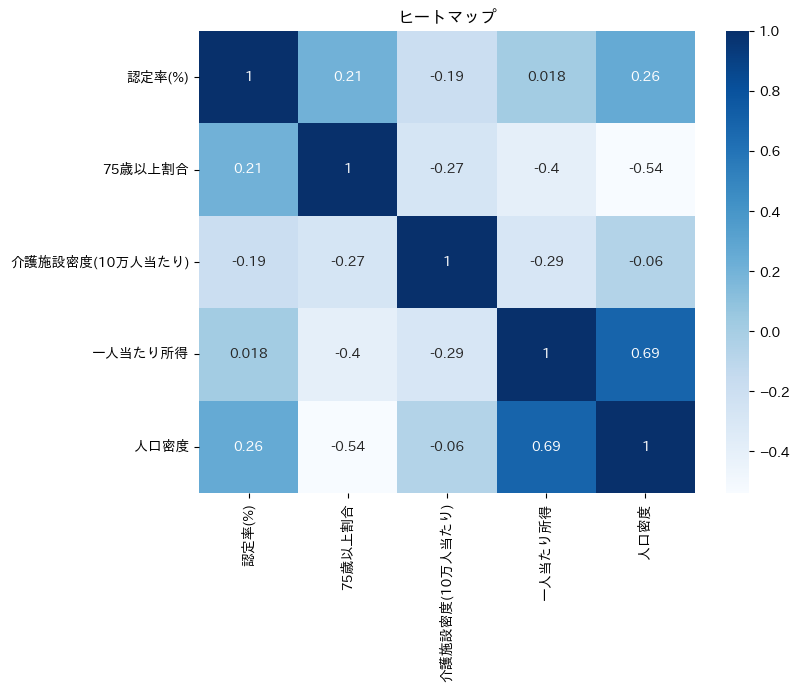
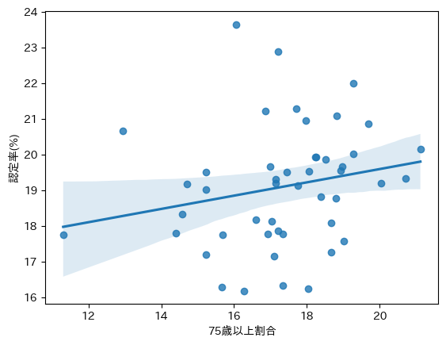

# 要介護認定率の予測モデル作成

要介護認定率を予測するモデルを作成する。

# 概要

都道府県別の高齢化関連指標を用いて、要介護認定率を予測する機械学習分析を行いました。
高齢化率や介護施設密度、所得水準などの地域特性と介護需要の関係を分析し、地域ごとの介護認定率に影響を与える要因を可視化・検証しています。

# 背景

日本では高齢化が急速に進行しており、地域ごとの介護需要の把握が重要な課題となっています。
特に、介護保険制度を支える自治体では、
・高齢化率
・介護施設の整備状況
・地域所得
・人口密度
など、複数の要因を踏まえた介護需要予測が求められています。
本分析では、公開統計データを用いて、地域特性と要介護認定率との関係性を定量的に分析しました。

# 使用データ
・e-Stat
・厚生労働省
・総務省統計局

# 主な使用指標
　　　指標　　　　　　　　　　内容
- 要介護認定率　　　　　　　目的変数
- ７５歳以上人口割合　　　　高齢化指標
- 介護施設密度　　　　　　　介護資源指標
- 一人当たり所得　　　　　　経済指標
- 人口密度　　　　　　　　　地域特性指標

# 使用技術
言語・分析環境
- Python
- Google Colab
ライブラリ
- pandas
- numpy
- matplotlib
- seaborn
- scikit-learn
- openpyxl

# 分析の流れ

1.公的統計データの収集
2.データ前処理
　・欠損値確認
　・都道府県名の統一
　・不要列削除
3.データ結合（merge）
4.相関分析
5.回帰モデル構築
6.モデル評価

# 使用モデル
線形回帰（Linear Regression）

# 評価指標
決定係数（R²）

# ヒートマップ

介護認定率と75歳以上人口割合、人口密度には弱い正の相関がみられた。

# 散布図

# 分析結果
- 要介護認定率と75歳以上人口割合、人口密度には弱い正の相関がみられた。
- 一方、重回帰モデルの決定係数（R²）は -0.00282 と低く、
都道府県単位の集計データのみでは認定率を十分に説明できなかった。
- RandomForestRegressor ではさらに精度が低下しており、
小規模データに対する過学習の可能性が示唆された。
- 本分析から、介護認定率には地域特性以外にも、
医療資源、世帯構成、健康状態など複数要因が影響している可能性が考えられる。

# 改善点
- 市町村単位での分析
- 時系列分析
- 特徴量の変更・追加

# ファイルの構成
care-certification-analysis/
├── data/
│   ├── raw/
│   └── processed/
│
├── notebooks/
│   └── care_certification_analysis.ipynb
│
├── outputs/
│   └── figures/
│
├── requirements.txt
├── README.md
└── .gitignore

